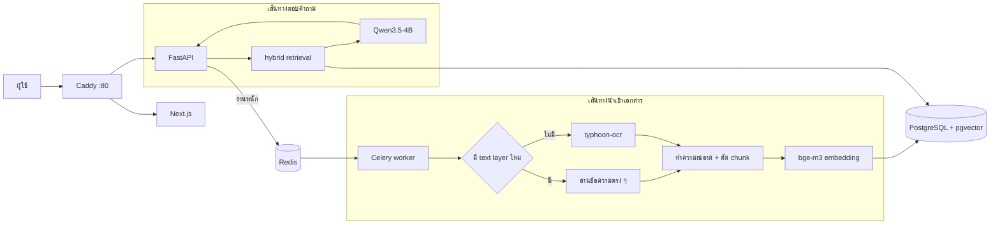

# RAG Workshop

ระบบถาม-ตอบจากเอกสารภายในองค์กร (RAG) ภาษาไทย — อัปโหลดเอกสาร ระบบ OCR เฉพาะหน้าที่จำเป็น
แล้วตอบคำถามพร้อม**อ้างอิงที่มาทุกครั้ง** รันทั้งหมดบนเครื่องเดียวผ่าน Docker
ไม่ส่งข้อมูลออกนอกองค์กร และไม่ต้องติดตั้ง Python หรือ Ollama บน Windows

หลักการที่ยึดตลอดทั้งโปรเจกต์: **ทุกคำตอบต้องตรวจย้อนกลับไปยังเอกสารต้นทางได้**
ถ้าไม่มีข้อมูลในคลัง ระบบต้องบอกว่าไม่รู้ ไม่ใช่เดา

---

## สถาปัตยกรรม



### ทำไมถึงออกแบบแบบนี้

| การตัดสินใจ | เหตุผล |
|---|---|
| **ตัดสินรายหน้าว่าต้อง OCR ไหม** | PDF ไทยส่วนใหญ่ผสมกัน หน้าที่มี text layer อยู่แล้วไม่ต้องเผา GPU — นี่คือที่มาของการประหยัดเวลามหาศาล |
| **hybrid retrieval (vector + keyword)** | คำถามเชิงโครงสร้าง ("ข้อ 3 พูดถึงอะไร") dense retrieval หาไม่เจอเพราะความหมายทับกับเนื้อหาน้อย · วัดแล้ว hit@1 88% → 100% |
| **ตัดคำไทยด้วย pythainlp ตอน ingest** | Postgres ไม่มี parser ภาษาไทย `to_tsvector` จะได้ token เดียวคือทั้งประโยค ค้นอะไรไม่เจอเลย |
| **งานหนักเข้าคิวเสมอ** | การ์ดใบเดียวตอบได้ทีละคำขอ ถ้าให้ OCR ทำใน request ผู้ใช้จะรอเป็นชั่วโมง |
| **ทุกโมเดลคุยผ่าน OpenAI-compatible API** | ย้ายไปการ์ดใหญ่ (vLLM + Qwen3.8-27B) หรือไปใช้ API ภายนอก ทำได้โดยแก้ `.env` ไม่ต้องแตะโค้ด |
| **denormalize ที่มาของคำตอบ** | `reprocess` ลบ chunk เก่าทิ้งเป็นเรื่องปกติ ถ้าผูก FK ไว้เฉย ๆ ประวัติเก่าจะไม่เหลือที่มา |

### Stack

| ชั้น | ใช้อะไร |
|---|---|
| Chat LLM | `qwen3.5:4b` Q4_K_M บน Ollama |
| OCR | `typhoon-ocr1.5-2b` Q4_K_M บน Ollama |
| Embedding | `BAAI/bge-m3` (1024 มิติ) บน HF Text-Embeddings-Inference — รันบน CPU |
| Backend | FastAPI + Celery + SQLAlchemy 2.0 (async) |
| Database | PostgreSQL 16 + pgvector (HNSW index) |
| Frontend | Next.js 16 (App Router) |
| Proxy | Caddy |

---

## ขอบเขตงานที่ทำเสร็จแล้ว

<details>
<summary><b>นำเข้าเอกสาร</b> — อัปโหลด, OCR, chunk, embed</summary>

- รองรับ PDF, รูปภาพ, docx, txt, markdown, html
- ตัดสินรายหน้าว่าหน้าไหนต้อง OCR — หน้าที่มี text layer อ่านตรง ๆ ข้าม GPU ไปเลย
- ทำความสะอาดข้อความ (ตัดเลขหน้า หัวกระดาษที่ซ้ำทุกหน้า อักขระล่องหน)
- ตัด chunk ตามหัวข้อ → ย่อหน้า → ประโยค (pythainlp) โดยไม่ตัดกลางคำไทย
- คิวงานพร้อมรายงานความคืบหน้ารายหน้าและ ETA
- อัปหลายไฟล์พร้อมกัน (admin) — ไฟล์ที่มีปัญหาถูกข้ามและรายงานกลับ ไม่ทำให้ทั้งชุดล้ม
- สั่งประมวลผลใหม่ได้โดยไม่คิดโควตาซ้ำ

</details>

<details>
<summary><b>ค้นคืนและตอบคำถาม</b></summary>

- hybrid retrieval รวมผล vector กับ keyword ด้วย RRF
- ตอบแบบสตรีมผ่าน SSE พร้อมเลขอ้างอิงในข้อความ
- บทสนทนาต่อเนื่อง — ถามต่อแบบกำกวมได้ ("แล้วสะสมข้ามปีได้ไหม")
- ตรวจภาษาของคำถามในโค้ดแล้วบังคับให้ตอบภาษาเดียวกัน
- คำลงท้ายสุภาพตั้งค่าได้ (`ครับ` / `ค่ะ` / ปิด) จากจุดเดียว
- ปฏิเสธเมื่อไม่มีข้อมูล และนับเป็น "ช่องว่างของคลังความรู้" ให้ admin เห็น
- failover: API หลัก → โมเดลสำรอง → ยกข้อความจากเอกสารมาแสดง

</details>

<details>
<summary><b>ผู้ใช้และโควตา</b></summary>

- โควตารายวัน: user 5 เอกสาร / 500 หน้า · admin ไม่จำกัด (รีเซ็ตเที่ยงคืนเวลาไทย)
- จองโควตาก่อนเข้าคิว คืนให้เมื่องานล้มก่อนแตะ GPU
- admin สร้าง/แก้/ปิด/ลบบัญชีได้ พร้อมกันไม่ให้ล็อกตัวเองออกหรือลบ admin คนสุดท้าย
- ไม่มีหน้าสมัครสมาชิกสาธารณะโดยตั้งใจ — คลังเป็นเอกสารภายใน

</details>

<details>
<summary><b>เครื่องมือสำหรับ admin</b></summary>

- **Playground** — เห็น chunk ดิบพร้อมคะแนน แยกได้ว่าผิดที่ retrieval หรือที่โมเดล
- **Prompt config** — สร้าง/เปิด/ปิด/ลบ ชุด prompt โดยไม่ต้องแก้โค้ด
- **Analytics** — ปริมาณการใช้, คำถามที่คลังตอบไม่ได้, เอกสารที่ถูกอ้างบ่อย, สถิติ ingestion
- **หน้าสถานะระบบ** — เช็คทุกบริการรวมถึงว่าโมเดลยังอยู่บน GPU หรือหล่นไป CPU

</details>

<details>
<summary><b>ความปลอดภัย</b></summary>

- กรองสิทธิ์ที่ระดับ SQL ทุกจุด และตอบ 404 ไม่ใช่ 403 กันการไล่เดาว่ามีของอยู่จริง
- อ่านสิทธิ์จาก database ทุก request ไม่ใช่จาก JWT — ปิดบัญชีแล้วมีผลทันที
- rate limit ที่ login สองชั้น (ต่อ IP เข้มงวด + ต่ออีเมลหลวมกว่า กันคนหมุน IP), chat/upload/playground (ต่อผู้ใช้)
- หา IP จริงจาก `X-Forwarded-For` โดยนับจากขวาตาม `TRUSTED_PROXY_HOPS` ไม่ใช่หยิบตัวซ้ายสุดที่ผู้เรียกแต่งเองได้
- บทสนทนาเป็นของเจ้าของเท่านั้น — ส่ง `session_id` ของคนอื่นมาได้ 404 ไม่ใช่การต่อบทสนทนา
- `/health/deep` แจกรายละเอียด (รุ่น ชื่อโมเดล สถานะ GPU) เฉพาะ admin คนอื่นเห็นแค่เขียว/แดง
- เวลาตอบของ login เท่ากันทั้งกรณีมีและไม่มีบัญชี กันการเดาอีเมลจากเวลา
- จำกัดขนาดไฟล์ระหว่างอ่าน ไม่ดึงทั้งไฟล์เข้าหน่วยความจำก่อน
- ไม่ส่งข้อความ exception ดิบให้ผู้ใช้ — ส่งรหัสอ้างอิงแล้วเก็บรายละเอียดไว้ใน log
- request model ปฏิเสธ field ที่ไม่รู้จัก ไม่เมินเฉย

</details>

<details>
<summary><b>Widget ฝังเว็บอื่น</b></summary>

ฝังด้วยแท็กเดียว สไตล์อยู่ใน shadow DOM ไม่ชนกับ CSS ของเว็บเจ้าบ้าน

```html
<script src="http://localhost/widget.js" defer></script>
```

</details>

---

## ตัวเลขที่วัดจริง

วัดบน **RTX 3050 6GB** (VRAM ว่างจริงราว 4.3 GB) ไม่ใช่ตัวเลขจากสเปกหรือการประมาณ

| เรื่อง | ผล |
|---|---|
| OCR | **5.2 วินาที/หน้า** (ภาพเรนเดอร์สะอาด) · ตั้ง ETA ไว้ 10 วิ/หน้าเผื่อสแกนจริงที่มี noise |
| ตอบคำถาม | **0.8–2.8 วินาที** สำหรับคำตอบสั้น · ถึงราว **7 วินาที** เมื่อคำตอบยาวหลายย่อหน้า |
| retrieval (hybrid) | hit@1 **100%** · MRR **1.000** ทั้งชุดคำถาม HR และชุดคำถามเขียนโปรแกรม |
| การปฏิเสธเมื่อไม่มีคำตอบ | ชั้น retrieval ปล่อยผ่านบ้าง แต่ชั้น LLM ปฏิเสธถูก **9/9** ในการวัดปลายทาง |
| รองรับได้ | ราว **5–10 users** ที่ใช้โควตาเต็มทุกวัน |
| เทส | API **299** · web **17** · smoke ผ่านทุกหมวด |

วัดซ้ำเองได้:

```powershell
.\dc.ps1 exec api python scripts/eval.py                                   # คุณภาพ retrieval
.\dc.ps1 exec api python scripts/eval.py --set /app/evalsets/programming.json
.\dc.ps1 exec api python scripts/smoke.py                                  # ยิง HTTP จริงด้วยโมเดลจริง
```

> `scripts/smoke.py` ต่างจาก pytest ตรงที่ยิงผ่าน HTTP จริง — จับบั๊กที่ pytest จับไม่ได้
> เช่น SSE ถูก buffer, ค่า `.env` ที่คอนเทนเนอร์จริงเห็น หรือโมเดลที่ไม่ทำตาม prompt

---

## เริ่มใช้งานครั้งแรก

### 1. ปรับ RAM ของ WSL2

WSL2 ตั้ง default ที่ 50% ของเครื่อง ซึ่งไม่พอสำหรับ stack นี้ (~6–6.5 GB)

```powershell
Copy-Item wslconfig.example $env:USERPROFILE\.wslconfig
wsl --shutdown
```

เปิด Docker Desktop ใหม่หลังจากนั้น

### 2. สร้าง `.env`

```powershell
Copy-Item .env.example .env
```

ต้องเติม: `POSTGRES_PASSWORD`, `APP_SECRET_KEY`, `ADMIN_EMAIL`, `ADMIN_PASSWORD`

### 3. ขึ้น stack

```powershell
.\dc.ps1 up -d --build
```

ครั้งแรกใช้เวลานาน — TEI ต้องโหลด bge-m3 (~2.3 GB) และ build image ของ api/web

### 4. โหลดโมเดลเข้า Ollama

```powershell
# ทีละตัว — โหลดพร้อมกันช้ากว่ามาก (วัดแล้ว 85 → 372 KB/s)
.\dc.ps1 exec ollama ollama pull scb10x/typhoon-ocr1.5-3b
.\dc.ps1 exec ollama ollama cp scb10x/typhoon-ocr1.5-3b typhoon-ocr
.\dc.ps1 exec ollama ollama pull qwen3.5:4b
```

`ollama cp` ตั้งชื่อสั้นให้ตรงกับ `TYPHOON_OCR_MODEL` ใน `.env` — เปลี่ยน quantization
ทีหลังก็แค่ pull ตัวใหม่แล้ว `cp` ทับชื่อเดิม โค้ดไม่ต้องแก้

### 5. รัน migration

```powershell
.\dc.ps1 exec api alembic upgrade head
```

### 6. ตรวจว่าพร้อม

```powershell
.\check.ps1
```

เข้าใช้งานที่ http://localhost:3000 ด้วยบัญชีที่ตั้งไว้ใน `.env`

---

## คำสั่งประจำวัน

```powershell
.\dc.ps1 up -d                            # ขึ้นทั้ง stack
.\dc.ps1 down                             # ปิด (ข้อมูลอยู่ใน volume ไม่หาย)
.\dc.ps1 logs -f worker                   # ดู log งาน OCR
.\check.ps1                               # สถานะระบบ + GPU + health
.\test.ps1                                # lint + typecheck + เทสทั้งหมด (ก่อน commit)
.\test.ps1 -Quick                         # ข้ามเทส API ที่ใช้เวลาราวสองนาที
```

**หลังแก้ `.env`** ค่าจาก `env_file` อ่านตอนสร้างคอนเทนเนอร์ ต้องสร้างใหม่ ไม่ใช่แค่ restart

```powershell
.\dc.ps1 up -d --force-recreate api worker
```

**หลังแก้ไฟล์ใน `web/src`** Turbopack ไม่ใช้ `WATCHPACK_POLLING` บน Windows
dev server จะไม่รีคอมไพล์เอง ต้อง `.\dc.ps1 restart web`

---

## ข้อจำกัดที่ต้องรู้

- **โหลดโมเดลได้ทีละตัว** `OLLAMA_MAX_LOADED_MODELS=1` เป็นข้อบังคับที่ VRAM 6 GB
  การสลับ OCR ↔ chat เสีย cold start ราว 15 วินาที
- **ถ้า VRAM ไม่พอ Ollama จะไม่ error** แต่ย้าย layer ไป CPU แล้วช้าลง 5–10 เท่าเงียบ ๆ
  เช็คด้วย `.\check.ps1` หรือ `/health/deep` — `PROCESSOR` ต้องเป็น `100% GPU`
- **คุณภาพ OCR บนสแกนจริงยังไม่ได้วัด** ตัวเลข 5.2 วิ/หน้ามาจากภาพเรนเดอร์สะอาด
- **widget ต้องล็อกอิน** ถ้าจะเปิดสาธารณะต้องเพิ่ม endpoint ที่ไม่ต้องยืนยันตัวตน
  ซึ่งเป็นการตัดสินใจเรื่องความปลอดภัยที่ต้องเลือกเอง

---

## ขึ้น Vercel

API ชุดนี้ deploy เป็น serverless function บน Vercel ได้ **บางส่วน** — ตัวแอปบูตได้
โดยไม่ต้องมี system library เลย (`magic`, `pypdf`, `PIL`, `celery`, `uvicorn`, `alembic`
ถูก import แบบ lazy ทั้งหมด · มีเทสบังคับไว้ที่ `tests/test_serverless_bundle.py`)

### ทำงานได้

เข้าสู่ระบบ · ถาม-ตอบแบบสตรีม · ค้นคืน (hybrid) · ประวัติบทสนทนา · โควตา ·
analytics · จัดการผู้ใช้ · playground · `/health`

### ทำงานไม่ได้ และแก้ไม่ได้ด้วยการตั้งค่า

**การนำเข้าเอกสาร** — อัปโหลด, bulk, reprocess · เพราะต้องมีครบสามอย่างที่ serverless ไม่มี

| ต้องการ | ทำไม serverless ให้ไม่ได้ |
|---|---|
| Celery worker | OCR กินเวลาเป็นนาทีต่อเอกสาร ทำใน request ไม่ได้ |
| poppler + libmagic | เป็น system binary ไม่ใช่แพ็กเกจ Python |
| GPU | typhoon-ocr ต้องใช้ · บน CPU ช้ากว่า 5–10 เท่า |
| ดิสก์ที่อยู่ถาวร | ไฟล์ต้นฉบับต้องอ่านซ้ำได้ตอน reprocess |

ตั้ง `INGESTION_ENABLED=false` แล้วสามเส้นทางนี้จะตอบ **503 พร้อมบอกว่าให้ไปทำที่ไหน**
แทนที่จะล้มด้วย `ImportError` หรือรับไฟล์ไว้แล้วมันหายตอน container ถูกรีไซเคิล

**วิธีใช้งานจริงคือแบ่งหน้าที่** — นำเข้าเอกสารบนเครื่องที่มี Docker + GPU
ส่วน Vercel ต่อเข้าฐานข้อมูลเดียวกันเพื่ออ่านและตอบคำถาม

### ต้องเตรียมบริการภายนอกก่อน

Vercel ไม่มี Postgres, Redis, GPU หรือ embedding server ให้ ต้องหามาต่อเอง

| ต้องการ | ใช้อะไรได้ | หมายเหตุ |
|---|---|---|
| PostgreSQL + **pgvector** | Neon, Supabase | ต้องรองรับ pgvector · รัน `alembic upgrade head` จากเครื่องที่มี Docker |
| Redis | Upstash | ใช้กับ rate limit |
| LLM | OpenRouter หรือเจ้าใดก็ได้ที่เป็น OpenAI-compatible | โค้ดรองรับอยู่แล้ว แค่ตั้ง `LLM_BASE_URL` + `LLM_API_KEY` |
| Embedding | บริการที่เสิร์ฟ **bge-m3** ได้ | ⚠️ ต้องเป็นโมเดลเดิม 1024 มิติ ถ้าเปลี่ยนโมเดล vector ที่มีอยู่ในฐานข้อมูลจะใช้เทียบกันไม่ได้ ต้อง reprocess ทั้งคลัง |

### ค่าที่ต้องตั้งบน Vercel

```
DATABASE_URL=postgresql+asyncpg://...
REDIS_URL=rediss://...
APP_SECRET_KEY=<ค่าเดียวกับที่ใช้อยู่ ไม่งั้น cookie เดิมใช้ไม่ได้>
LLM_BASE_URL=...        LLM_API_KEY=...        LLM_MODEL=...
EMBEDDING_BASE_URL=...  EMBEDDING_API_KEY=...
INGESTION_ENABLED=false
API_DOCS_ENABLED=false
COOKIE_SECURE=true
TRUSTED_PROXY_HOPS=1
CORS_ALLOWED_ORIGINS=https://<โดเมนของ frontend>
```

### deploy

โปรเจกต์ Vercel ของ API ใช้ **รากของ repo** เป็น root directory (เพราะ `@vercel/python`
มองหา entrypoint ใน `api/`) ส่วนหน้าเว็บเป็นคนละโปรเจกต์ที่ root เป็น `web/`

```powershell
npx vercel --prod          # จากรากของ repo
```

แล้วชี้หน้าเว็บมาที่นี่ด้วยการตั้ง `BACKEND_HTTPS_ORIGIN` ของโปรเจกต์ frontend
เป็นโดเมนของ API ที่เพิ่ง deploy — **ไม่ต้องใช้ ngrok อีก** สำหรับการสาธิตการถาม-ตอบ
(ยังต้องใช้เครื่องที่มี Docker เมื่อจะนำเข้าเอกสารใหม่)

ไฟล์ที่เกี่ยวข้อง: [`vercel.json`](vercel.json) · [`.vercelignore`](.vercelignore) ·
[`api/index.py`](api/index.py) · [`api/requirements.txt`](api/requirements.txt)

> `api/requirements.txt` ใช้เฉพาะบน Vercel — ที่อื่นยังใช้ `pyproject.toml`
> ตัดแพ็กเกจฝั่ง ingestion ออกเพื่อให้ bundle อยู่ใต้เพดาน 250 MB
> (`pythainlp` 65 MB ยังต้องมี เพราะ keyword leg ของ hybrid ใช้ตัดคำไทย
> ถอดออกแล้ว hit@1 ตกจาก 100% เหลือ 88%)

---

## สิ่งที่ยังต้องทำ

> ผลตรวจฉบับเต็มเมื่อ 21–22 ก.ย. 2026 พร้อมสิ่งที่แก้ไปแล้วอยู่ใน **[AUDIT.md](AUDIT.md)**

### ควรทำก่อนเปิดใช้จริง

- [x] ~~ตั้ง `API_DOCS_ENABLED=false`~~ — default เป็น false แล้ว เปิดเฉพาะตอน dev ผ่าน `docker-compose.override.yml`
- [x] ~~`COOKIE_SECURE=true` เมื่อขึ้น HTTPS~~ — `docker-compose.https.yml` ตั้งให้แล้ว
- [ ] เปลี่ยน `APP_SECRET_KEY` จากค่า default (ระบบยังไม่บังคับให้เปลี่ยน)
- [ ] วัดคุณภาพ OCR ด้วยไฟล์สแกนจริง แล้วปรับ `OCR_SECONDS_PER_PAGE` ตามที่วัดได้
- [ ] ทดสอบ CI บน GitHub จริง — เขียน workflow ไว้แล้วแต่ยังไม่เคยรัน

### ฟีเจอร์ที่ยังไม่มี

- [ ] `docker-compose.gpu.yml` สำหรับ tier PROD (vLLM + Qwen3.8-27B) — โค้ดรองรับแล้ว เหลือแค่ไฟล์ compose
- [ ] reranker (`bge-reranker-v2-m3`) — hybrid ยก hit@1 เป็น 100% แล้ว ยังไม่มีหลักฐานว่าจำเป็น
- [x] ~~ปุ่ม reprocess / bulk upload ในหน้าเว็บ~~ — อยู่ในหน้าเอกสารแล้ว (เห็นเฉพาะ admin)
- [x] ~~ค้นหาและกรองในหน้ารายการเอกสาร~~
- [ ] เลือก collection ตอนถาม — ระบบรองรับที่ API แล้วแต่ UI ยังไม่มีตัวเลือก
- [ ] widget ใช้กับ frontend ที่ host แยกไม่ได้ — `widget.js` เรียก `fetch` ตรง ไม่ผ่าน `apiFetch` และ `/api/widget/config` คืน `api_base` เป็น localhost

### หนี้ทางเทคนิค

- [ ] chunker ตัดตามหัวข้อ markdown แต่ typhoon-ocr คืนข้อความธรรมดา — หน้ายาวหลายเรื่องจะได้ chunk ที่ปนกัน
- [ ] เทสฝั่ง web มีแค่ตรรกะล้วน ยังไม่มีเทสที่ render component — ใช้ภาพหน้าจอใน `artifacts/` แทนไปก่อน
- [ ] งาน ingestion ที่ "เริ่มแล้วค้างกลางทาง" ยังต้องแก้เอง — ต้องมี heartbeat ถึงจะแยกจากงานที่กำลังเดินอยู่ได้
- [ ] `looks_like_refusal()` จับถ้อยคำภาษาไทย ถ้าตั้ง prompt config ให้ปฏิเสธด้วยคำอื่นทั้งหมด การนับช่องว่างของคลังจะพลาด
- [ ] ชุดเทสมี flake ราว 1 ใน 282 ตัวต่อรอบ — `StaleDataError` ในเทสที่ยิง Celery/Redis จริง
- [ ] `chat_sessions.client_ip` บันทึก IP ของ proxy ไม่ใช่ของผู้ใช้ — ไร้ประโยชน์ตามที่เป็นอยู่ และถ้าทำให้ใช้ได้จริงต้องคิดเรื่อง PDPA ก่อน

---

## โครงสร้างโปรเจกต์

```
├── README.md                   ไฟล์นี้
├── PLAN.md                     แผนงานฉบับเต็ม สถาปัตยกรรม และการตัดสินใจ
├── RESUME.md                   บันทึกสถานะ ตัวเลขที่วัดได้ และบั๊กที่เจอ
├── AUDIT.md                    ผลตรวจ 21–22 ก.ย. 2026 และสิ่งที่แก้ไปแล้ว
├── DEMO.md                     บัญชีสาธิตและการเปิด tunnel
├── docker-compose.yml          app stack
├── docker-compose.local.yml    Ollama + GPU (tier LOCAL)
├── docker-compose.override.yml hot reload ตอน dev
├── docker-compose.https.yml    tunnel สำหรับสาธิต (ngrok -> Caddy)
├── vercel.json / .vercelignore  deploy API ขึ้น Vercel (ดูหัวข้อ "ขึ้น Vercel")
├── dc.ps1 / check.ps1 / test.ps1 / backup.ps1
├── caddy/Caddyfile
├── corpus/programming/         เอกสารตัวอย่างสำหรับเติมคลัง
├── api/
│   ├── index.py                entrypoint ของ Vercel (ส่งต่อ app.main เฉย ๆ)
│   ├── requirements.txt        deps เฉพาะตอนขึ้น Vercel (ตัดฝั่ง ingestion ออก)
│   ├── alembic/versions/       migration 0001–0005
│   ├── evalsets/               ชุดคำถามวัดคุณภาพ retrieval
│   ├── scripts/                eval.py · smoke.py · spike.py · purge_chats.py
│   ├── tests/                  37 ไฟล์
│   └── app/
│       ├── core/               config, db, security, deps, ratelimit
│       ├── models/             SQLAlchemy
│       ├── schemas/            pydantic (StrictModel, Page)
│       ├── routers/            35 endpoints
│       ├── llm/                client, chain, orchestrator, prompts
│       ├── retrieval/          embeddings, search, keywords
│       └── ingestion/          detect, parsers, ocr, chunk, clean, tasks
└── web/
    ├── scripts/check-contrast.mjs  วัด contrast ของ token ทั้งสองโหมด
    ├── src/app/                8 หน้า
    ├── src/components/         Nav, Shell, Icon, PageIntro, ThemeToggle
    ├── src/lib/                api, useAuth, citations
    └── public/widget.js        widget ฝังเว็บอื่น
```

---

## เอกสารอื่น

- **[PLAN.md](PLAN.md)** — แผนงานฉบับเต็ม การตัดสินใจเชิงสถาปัตยกรรม ข้อจำกัดฮาร์ดแวร์ และเฟสงาน
- **[RESUME.md](RESUME.md)** — บันทึกสถานะปัจจุบัน ตัวเลขที่วัดจริงทุกตัว และรายการบั๊กที่เจอพร้อมวิธีแก้
